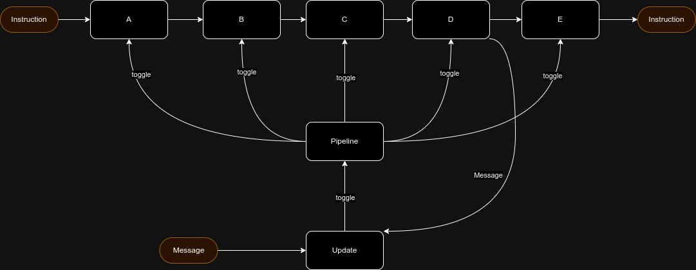

# Simulador MIPS Pipeline

Simulador simples de CPU com arquitetura MIPS em modo pipeline. Conta com 32 registradores de 8 bits,
sendo o primeiro reservado para simular a memória, e 5 estágios.

# Quickstart

Para compilar é necessário ter [go](https://go.dev/doc/install) instalado. Basta executar:
```shell
make run
```

# Core 

Ao iniciar, o simulador buscará um arquivo `instrucoes.txt` localizado na raiz do projeto. No 
momento as instruções suportadas são

| Comando | Exemplo        | Obs                                                                      |
|---------|----------------|--------------------------------------------------------------------------|
| ADDI    | addi R0 R1 R2  | Adiciona dois registradores e armazena noutro (simulando a instrução lw) |
| ADD     | add R1 R2 R3   | Realiza a soma de dois registradores                                     |
| SUBI    | subi R0 R0 R0  | Subtrai dois registradores                                               |
| SUB     | sub R1 R2 R3   | Subtrai dois registradores                                               |
| BEQ     | beq R1 R2 loop | Move PC para label "loop" caso R1 e R2 tenham mesmo valor                |
| J       | j loop         | Move PC para label "loop"                                                |

Ao iniciar, a primeira ação do simulador é analisar todas as instruções em busca de labels, mapeando 
o nome e o respectivo PC. Um uso comum das labels é declaração de "variáveis". Exemplo:

```txt
neg1 .fill -1
```

Também é possível declarar lables antes de alguma instrução:

```txt
loop add 2 1 2
```

E os estágios são:
| Estágio   | Responsabilidade                         |
|-----------|------------------------------------------|
| Fetch     | Recebe o PC e returna a instrução        |
| Decode    | Lê a instrução em texto e cria instância |
| Execute   | Executa a tarefa da instrução            |
| Memory    | Bypass, por enquanto                     |
| WriteBack | Bypass, por enquanto                     |

Cada estágio da pipeline é controlado em uma goroutine. Após registradores e lables configuradas, 
as intruções começam a ser iteradas. Um laço envia o program counter (PC) atual para a pipeline através 
de um canal, e bloqueia até que seja consumido.

Cada estágio, após receber a mensagem e processar sua tarefa, aguarda uma mensagem para enviar a instrução
para o próximo estágio.



# TUI

*Terminal UI*. O simulador conta com uma camada de visualização do processo pelo terminal desacoplada
dos processos da pipeline, que utiliza o framework [Bubble Tea](https://github.com/charmbracelet/bubbletea).
As goroutines comunicam seu estado/eventos para o laço de eventos (update) do TUI através de um canal de eventos.


